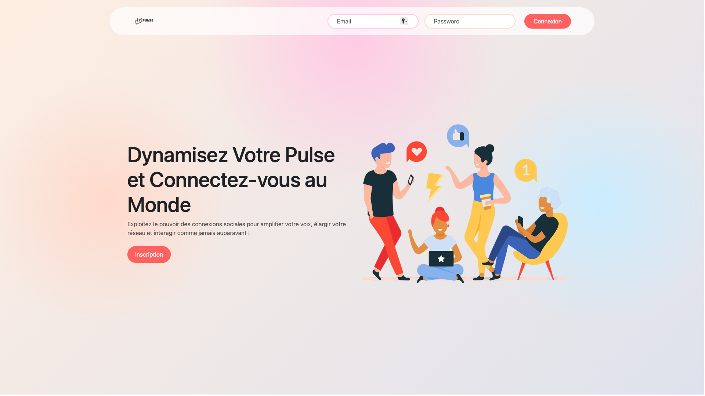
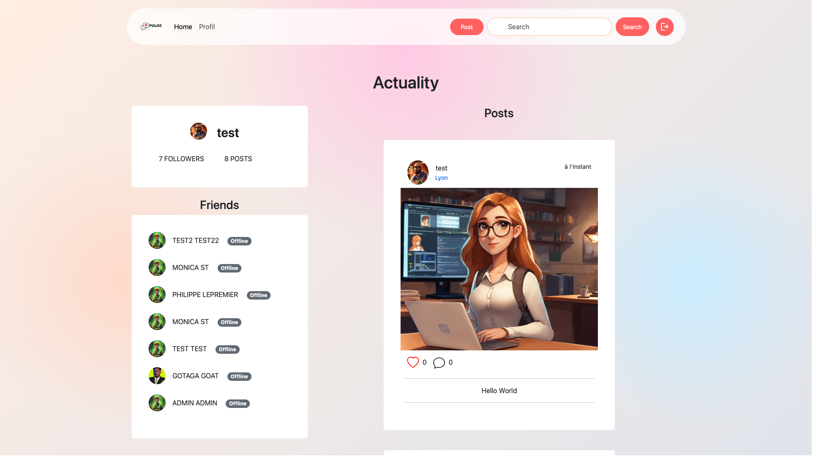

# BENVENUE SUR PULSE 

Ceci est mon premier projet php, Pulse est un réseau social qui permet de partager vos photos, ajouter vos amis et bientôt bien plus encore. Actuellement vous pouvez trouver des utilisateurs consultés leurs profils ainsi que leurs posts vous pouvez aussi vous inscrire afin de découvrir toutes les fonctionnalités du site. 😁

## CONFIGURATION ⚙️

Créer un fichier `db.ini` avec ce modèle (disponible dans `config/db.ini-template`) :

```ini
DB_HOST="localhost"
DB_PORT=3306
DB_NAME="dbname"
DB_CHARSET="utf8mb4"
DB_USER="user"
DB_PASSWORD="password"
```
Vous trouverez dans le dossier data la base de données que j'ai utilisé, vous pouvez la copier et coller dans votre serveur. 

Si vous voulez avoir un aperçu sans vous inscrire voici les identifiants d'un utilisateur que j'ai créé : 

**_Email_**: test@test.net

**_MP_**: test

## UPDATE NECESSAIRES 🔜

- Possibilité de delete ses posts 
- Ajout des commentaires, et about


## UPDATE DU FRONT  (09/09/2024)
- Mise en forme du Front
- Responsive

## POSTS ✉️
- [user_homepage.php: Page après la connexion du user](user_homepage.php)
- [UserPost.php: classe utilisée pour récuperer les posts des amis](classes/UserPost.php)
- [FriendshipsTable.php: classe utilisé pour récupérer les noms et prénoms des amis](classes/FriendshipsTable.php)

Je me suis un peu compliqué la tâche à vouloir tout séparer dans mon code et je pense avoir manqué d'organisation. J'aurais probablement pu assembler ses méthodes, étant donné que je peux récupérer les données des amis dans les deux classes. Ils se ressemble fortement et j'aurais donc pu refactoriser cette partie de mon code. 

```php
try {
    $pdo = getDbConnection();
    $postDb = new UserPost($pdo);
    $friendsDb = new FriendshipsTable($pdo);
} catch (PDOException) {
    echo "Erreur lors de la connexion à la base de données";
    exit;
}
$friends = $friendsDb->findFriends($_SESSION["userInfos"]["id"]);
$postfriends = $postDb->findFriendPosts($_SESSION['userInfos']['id']);
$posts = array_merge($postDb->findAll());
```
## AFFICHAGE DES PROFILS APRÉS UNE RECHERCHE 🔎
- [navbar.php: layout de ma navbar utiliser dans le site qui contient ma barre de recherche](layout/navbar.php)
- [navbarProcess.php: cette page récupére les données GET de ma barre de recherche et redirgire vers la page d'affichage](navbarProcess.php)
- [allUsers.php: cette page récupére et affiche les données de la requêtes](allUsers.php)

Comme dis plus haut je pense avoir compliqué la tâche je récupère donc les données de mon formulaire en méthode GET (dans l'url) et j'utilise **htmlspecialchars** qui convertit les caractères spéciaux de ma requête en entités html. Je traite celui-ci et l'envoie vers allUsers.php  qui traitera donc la donnée encore une fois et l'affichera.  
Je traite deux fois les données et je pense pouvoir le faire en une seule fois ceci est donc un axe d'amélioration dans mes updates. 

## FRIEND 🤝
- [allUsers.php: affiche les utilisateurs après la recherche](allUsers.php)
- [FriendshipsTable.php: classe qui permet d'ajouter un utilisateur a ses amis](classes/FriendshipsTable.php)

Une fonctionnalité assez simple à mettre en place, la difficulté était de récupérer les informations des Users avec les requêtes sql inner join que je n'avais pas beaucoup pratiqué mais dans l'ensemble cela c'est bien passé. 

## PICTURES 📷



## DEBUG 🔨

Pour les problèmes de code et message d'erreur il était plutôt difficile de travailler sans xdebug pour utiliser le pas-à-pas. J'ai donc utilisé les **exit()**; et les **var_dump** pour voir si mes données étaient bien enregistrées au fur et à mesure. 

## OUTILS 💻

Voilà ce que j'ai utilisé pour ce projet : 

 


